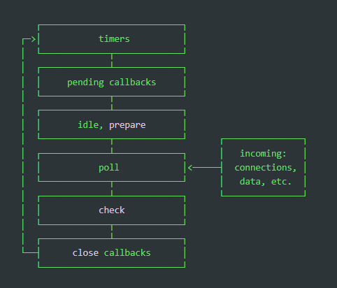

# NodeJS Event Loop

- node is single threaded
- most modern kernels are multithreaded
- node offloads operations to system kernel whenever possible
  - when these ops complete, the appropriate callback is added to the poll queue
  - where it's eventually picked up and executed

## Flow

- nodejs starts
- initialized event loop
- process the provided i/p script
  - many async API calls
  - schedule timers
  - call process.nextTick()
- begin processing event-loop

### Phases

- each phase has a FIFO queue of callbacks to execute
- when event loop enters a phase
  - perform any operations specific to that phase
  - execute callbacks in that phase's queue until exhaustion or max_callbacks
  - move to next phase
- any of these operations may schedule more operations
- in poll phase, new events processed are queued by the kernel
  - poll events can be queued while polling events are being processed
  - this affects the timer's threshold, since long running i/o callbacks can affect the runtime of the poll phase

### Phases Overview

- **timers**
  - this phase executes callbacks scheduled by `setTimeout()` and `setInterval()`
- **pending callbacks**
  - executes i/o callbacks deferred to the next loop iteration
- **idle, prepare**
  - only used internally
- **poll**
  - retrieve new i/o events
  - execute i/o related callbacks (except "close", timers, `setImmediate()`)
  - node will block here when appropriate
    - cases where there is no other callbacks pending, and next iter of event loop will terminate the NodeJS env
- **check**
  - `setImmediate()` callbacks are invoked here
- **close callbacks**
  - some close callbacks
  - eg: `socket.on('close' ...)`

#### Between each run of the event loop

- NodeJS checks if it's waiting for any async I/O or timers
- if not, shutdown cleanly
- else, next iter of event-loop

### Phases in Detail

#### timers

- timer specifies the threshold _**after**_ which a callback _**maybe**_ executed
- NOT THE EXACT TIME!
- timers callbacks will run as early as possible after the interval specified
- OS scheduling or running of other callbacks may delay them
- **poll** pase controls when timers are executed

Example:

- a timeout is scheduled after 100ms threshold
- a readFile starts async which takes 95ms, and has a callback which takes 10ms
- when the event loop enters the **poll** phase
  - it has empty queue initially
  - it waits till the soonest timer's threshold is reached, the soonest timer being 100ms here
  - but before the timer's threshold is reached, @ 95ms the readFile is completed
  - readFile's callback is added to the poll queue and executed, which takes 10ms
  - after the operation (t=105ms) the event-loop sees that the timer's threshold is reached
  - wraps back to the timer's phase to execute the timer's callback
- to prevent starving the event loop, `libuv` also has a hard max before it stops polling for more events

#### pending callbacks

- executes callbacks for some system operations
- like, types of TCP errors
  - eg: if a TCP socket receives `ECONNREFUSED` when attempting to connect
  - some \*nix systems want to wait to report the error
  - this will be queues to execute in pending callbacks phase

#### poll

- has 2 main functions:
  - calculate how long it should block and poll for i/o
  - process events in the poll queue
- when the event-loop enters the poll phase and there are no timers scheduled, one of 2 things will happen:
  - if the poll queue is not empty
    - the event loop will iterate through the queue till empty or hard-limit is reached
  - else
    - if scripts have been scheduled by `setImmediate()`
      - the event loop will end the poll phase
      - continue to the **check** phase to execute those scheduled scripts
    - else
      - wait for callbacks to be added to the queue, then execute immediately
- once the poll queue is empty, the event-loop will check for timers whose time thresholds have been reached
  - if one or more timers are ready, the event loop will wrap back to the timers phase to execute those timers' callbacks

#### check

- execute callbacks immediately after the poll phase has completed
- if the poll phase becomes idle and scripts have been queued with `setImmediate()`
  - event-loop may continue to the check phase instead of waiting
- `setImmediate()` is a special timer
  - runs in a separate phase of the event loop
  - uses a libuv API that schedules callbacks to execute after the poll phase
- generally, as the code executes, the event loop will eventually hit the poll phase
  - here it waits for an incoming connection, request, etc...
  - but, if a callback is scheduled with `setImmediate()` and the poll phase becomes idle
  - it will end and continue to the check phase instead of waiting

#### close callbacks

- if a socket or handle is closed abruptly
- the 'close' event will be emitted
- otherwise, it's emitted via `process.nextTick()`

## Some additional concepts

### `setImmediate()` VS `setTimeout()`

- `setImmediate()` is designed to execute a script once the current poll phase ends
- `setTimeout()` schedules a script to be run after a min threshold
- `setImmediate(...)` VS `setTimeout(..., 0)`
  - if both are set outside an i/o cycle
    - the order of execution is non-deterministic
  - else, if both are set inside i/o cycle
    - `setImmediate()` is always executed first, before any timers

### `process.nextTick()`

- not part of the event-loop
- but, part of the asynchronous API
- the `nextTickQueue` will be processed after the current "operation" is completed
  - regardless of the current phase of the event loop
  - "operation" = transition from the underlying C/C++ handler and handling the JS that needs to be executed
  - which in simpler terms means that the rest of the code is executed, while the event-loop is paused
- any time `process.nextTick()` is called in any given phase
  - all callbacks passed to `process.nextTick` will be resolved before the event-loop continues
  - can cause issues as it allows starvation of i/o by making recursive `process.nextTick()` calls which prevent the event-loop from reaching the poll phase
