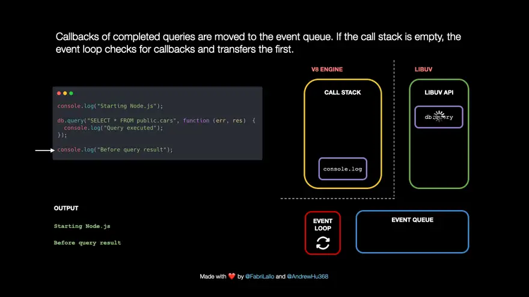

# NodeJS Events

- emitters emit named events that cause listeners to be called
- all objects that emit events are
  - instances of `EventEmitter` class
  - expose an `eventEmitter.on()` function
  - one/more functions can be attached to named events emitted
- when event is emitted
  - all attached functions are called **synchronously** in order of registration
  - any values returned are ignored & discarded
- `context` is passed implicitly and can be used via `this`
- arguments can also be passed
- for async mode of operation in listener
  - `setImmediate()`
  - `process.nextTick()`
- events registered with `once()` can only be triggered once
- error events
  - any error that occurs in an EventEmitter instance, 'error' event is emitted
  - if no listener is registered for 'error'
    - the error is throws
    - a stack trace is printed
    - Node.js process exits
  - to guard against crashing, `domain` module can be used (but it's deprecated)
- errors can be monitored without consuming the error
  - using `errorMonitor` from `node:events`
- async event handlers
  - aren't generally used since they can cause throw exception while async execution
  - those exception are not handled by default, and will exist the NodeJS runtime after throwing exception
  - `captureRejections` option in `EventEmitter` constructor can be used to change the behavior
    - this installs a `.then(undefined, handler)` method if there is one, or to `error` event handler if there is none
    - the `error` events that are generated by `captureRejections` behaviour do not have a catch handler to avoid infinite error loops

## How it works behind the scenes

- function stack contains the context of currently executing function
- heap contains objects in memory
- message_queue contains events

### Explained more succinctly by the image

